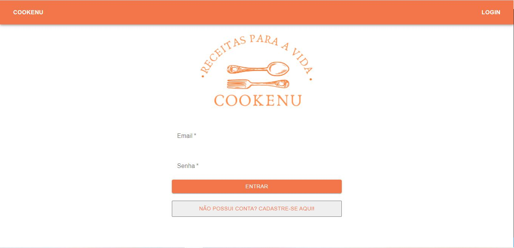
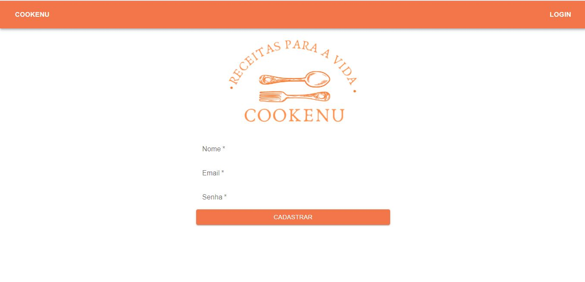
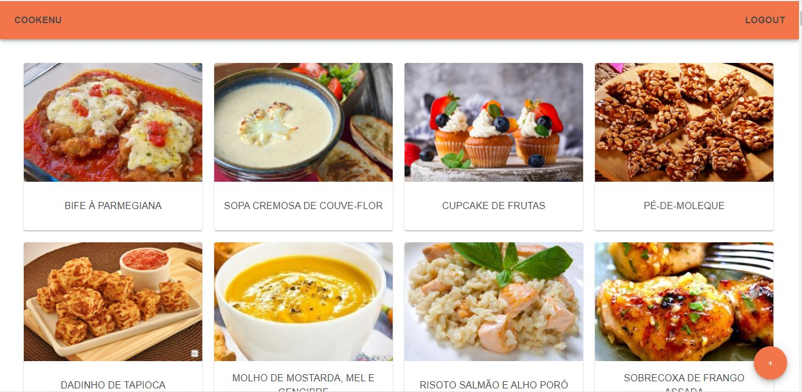

# **Projeto Cookenu**

## O que é:
Esse projeto foi desenvolvido com o intuito de simular um site de receitas culinárias básico.
Para ter acesso a estas receitas, o usuário pode se cadastrar necessitando de nome, email válido e senha com no minimo 6 caracteres, ou caso já esteja cadastrado, somente precisa se logar utilizando email e senha.
Na página inicial, após o login, aparece uma lista com fotos e títulos de todas as receitas disponíveis no site. Ao clicar na foto, abre o detalhamento da mesma. Fixo no canto inferior direito está o botão de adicionar refeitas, onde o usuário pode colaborar e compartilhar sua receita, basta preencher os campos com título, descrição e o link com a foto.

## Tecnologias utilizadas:
- Styled-componentes;
- Material-UI;
- Axios;
- React js;
- API Cookeny;
- React Router;

**Link do surge:**
http://foolish-hill.surge.sh/login

## Usuário para testes:
- *email:* usuarioteste@email.com,
- *senha:* 123456

## Imagens:

Página de Login (inicial)

Página de Cadastro (inicial)

Página do Feed (inicial)

